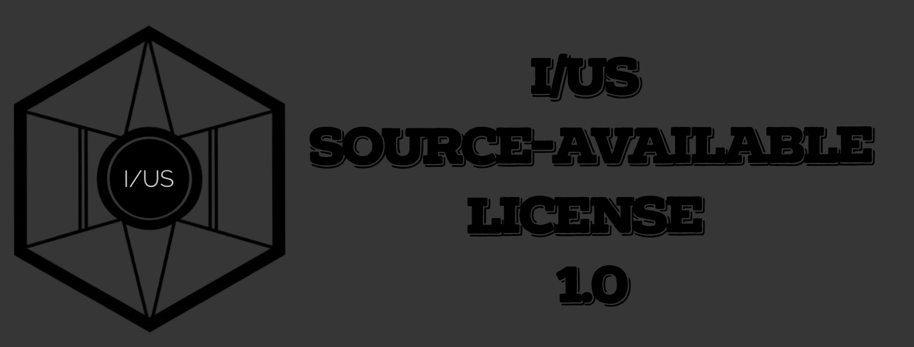
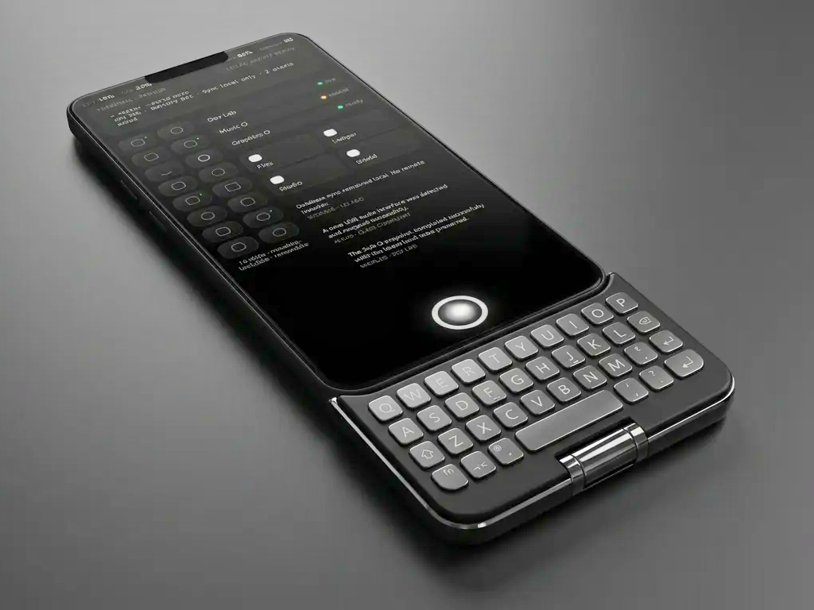

 
* https://iusmusic.github.io/O

## O

O is a full independent smartphone and tablet operating system built around a protected Mother O core, sandboxed Sub O environments, and machine-native internal languages for software, graphics, and music.

## Purpose

O exists to enable freedom through safe, transparent, and programmable computing.

It is designed for people who want to:
- build tools directly on their device
- use local or brokered AI to create software
- inspect what the system is doing
- experiment safely inside isolated worlds
- own and evolve their computing environment without giving up recovery and control

## Core laws

1. O is a full independent operating system.
2. Mother(O) O is protected.
3. Sub O is the place for experimentation.
4. O is installable as the only OS on supported devices.
5. Local AI is the default mode.
6. Online AI is optional and brokered by default.
7. Sub O can access O files without user interaction and password input. 
8. Promotion to O is staged, validated, and rollback-safe.
9. All meaningful changes should be visible, auditable, and reversible.
10. O is designed first for programmers, AI users, and technical builders.

## System model

- **O**: the protected flagship environment, full OS surface, control plane, and trust root.
- **Sub O**: repo-backed isolated programmable worlds for experimentation, development, alternate environments, and service relationships.
- **The Library**: O’s layered memory and evolution system for software, graphics, music, templates, worlds, and trusted reusable objects.
- **O-IR**: machine-native software representation.
- **O-GFX**: machine-native graphics representation.
- **O-MUS**: machine-native music representation.

## Reference device

- **Reference device**: Google Pixel 8 (unlocked retail model)
- **Initial delivery**: developer-oriented flashable image
- **Long-term goal**: controlled normal-user installation path
## What this repository includes

- vision and architecture documents
- O and Sub O specifications
- security model and privacy direction
- UI and interaction guidance
- device strategy and roadmap docs
- starter specs for:
  - **O-IR**
  - **O-GFX**
  - **O-MUS**
- Pixel 8 bring-up starter documentation
- Sub O manifest JSON schema

## Core concept

### O
O is the main system surface and orchestration layer. It is responsible for the core OS experience, system control, coordination, and shared platform services.

### Sub O
Sub O environments are modular worlds or focused runtime spaces that extend the system for specific use cases. This model is intended to support specialized workflows without turning the main system into a monolithic interface.

## Current scope

This repository is primarily a **specification and planning package**. It is intended to define:

- platform vision
- architectural direction
- subsystem boundaries
- security expectations
- UI principles
- implementation starting points

It is not positioned as a complete production OS release.

## Featured starter modules

### O-IR
Starter specification for machine-native software representation.

### O-GFX
Starter specification for graphics-related services, rendering, or visual pipeline work.

### O-MUS
Starter specification for music, audio, or media-focused system capabilities.

## Device target

The package includes a **Pixel 8 bring-up starter path**, providing an early hardware reference target for bootstrapping and testing platform assumptions.

## Schema support

A **Sub O manifest JSON schema** is included to define how modular environments are described, declared, and validated.

## Who this is for

This repository is useful for:

- system architects
- OS designers
- platform engineers
- UI and interaction designers
- security reviewers
- collaborators evaluating the Mother O / Sub O model

## Repository goal

The goal of this repository is to provide a clear and structured foundation for building O OS as a modular, design-driven, and security-conscious operating system platform.

## Status

Early-stage specification repository.

Interfaces, architecture details, and implementation plans are expected to evolve as the platform matures.

## Maintainer

**Pezhman Farhangi**

## License

**I/US Source-Available License 1.0**

See [LICENSE](./LICENSE).

Copyright (c) 2026 Pezhman Farhangi  
I/US Music

## Contact

For licensing requests, commercial rights, redistribution requests, derivative work permissions, or permission to use protected brand assets, prior written permission must be obtained from I/US Music.

