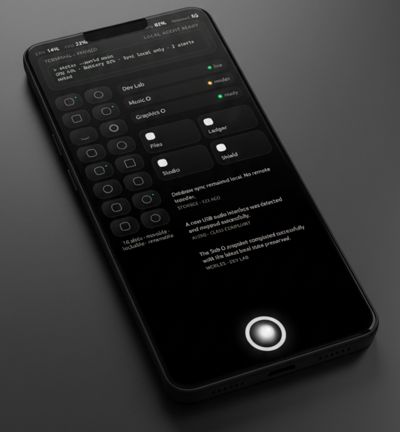
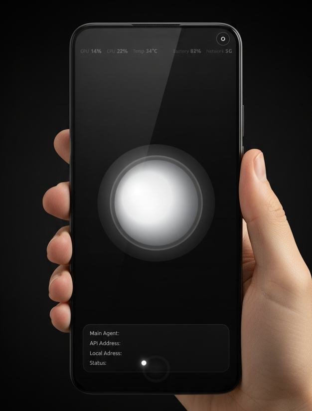

**Demo**  
* https://iusmusic.github.io/O

# O

O is a full independent smartphone and tablet operating system built around a protected Mother O core, sandboxed Sub O environments, and machine-native internal languages for software, graphics, and music.

## Purpose

O exists to enable freedom through safe, transparent, and programmable computing.

It is designed for people who want to:
- build tools directly on their device
- use local or brokered AI to create software
- inspect what the system is doing
- experiment safely inside isolated worlds
- own and evolve their computing environment without giving up recovery and control

## Core laws

1. O is a full independent operating system.
2. Mother O is protected.
3. Sub O is the place for experimentation.
4. O is installable as the only OS on supported devices.
5. Local AI is the default mode.
6. Online AI is optional and brokered by default.
7. No Sub O can access Mother O files, memory, or secrets without explicit gateways.
8. Promotion to Main O is staged, validated, and rollback-safe.
9. All meaningful changes should be visible, auditable, and reversible.
10. O is designed first for programmers, AI users, and technical builders.

## System model

- **Mother O**: the protected flagship environment, full OS surface, control plane, and trust root.
- **Sub O**: repo-backed isolated programmable worlds for experimentation, development, alternate environments, and service relationships.
- **The Library**: O’s layered memory and evolution system for software, graphics, music, templates, worlds, and trusted reusable objects.
- **O-IR**: machine-native software representation.
- **O-GFX**: machine-native graphics representation.
- **O-MUS**: machine-native music representation.

## Reference device

- **Reference device**: Google Pixel 8 (unlocked retail model)
- **Initial delivery**: developer-oriented flashable image
- **Long-term goal**: controlled normal-user installation path
## What this repository includes

- vision and architecture documents
- Mother O and Sub O specifications
- security model and privacy direction
- UI and interaction guidance
- device strategy and roadmap docs
- starter specs for:
  - **O-IR**
  - **O-GFX**
  - **O-MUS**
- Pixel 8 bring-up starter documentation
- Sub O manifest JSON schema

## Core concept

### Mother O
Mother O is the main system surface and orchestration layer. It is responsible for the core OS experience, system control, coordination, and shared platform services.

### Sub O
Sub O environments are modular worlds or focused runtime spaces that extend the system for specific use cases. This model is intended to support specialized workflows without turning the main system into a monolithic interface.

## Current scope

This repository is primarily a **specification and planning package**. It is intended to define:

- platform vision
- architectural direction
- subsystem boundaries
- security expectations
- UI principles
- implementation starting points

It is not positioned as a complete production OS release.

## Featured starter modules

### O-IR
Starter specification for machine-native software representation.

### O-GFX
Starter specification for graphics-related services, rendering, or visual pipeline work.

### O-MUS
Starter specification for music, audio, or media-focused system capabilities.

## Device target

The package includes a **Pixel 8 bring-up starter path**, providing an early hardware reference target for bootstrapping and testing platform assumptions.

## Schema support

A **Sub O manifest JSON schema** is included to define how modular environments are described, declared, and validated.

## Who this is for

This repository is useful for:

- system architects
- OS designers
- platform engineers
- UI and interaction designers
- security reviewers
- collaborators evaluating the Mother O / Sub O model

## Repository goal

The goal of this repository is to provide a clear and structured foundation for building O OS as a modular, design-driven, and security-conscious operating system platform.

## Status

Early-stage specification repository.

Interfaces, architecture details, and implementation plans are expected to evolve as the platform matures.

## Maintainer

**Pezhman Farhangi**

# Open Source License, Trademark, and Design Notice

**Copyright © 2026 Pezhman Farhangi. All rights reserved except as expressly licensed below.**

> This repository contains open-source software. The code is open, but the project identity, brand assets, and distinctive visual design are protected separately.

## 1) Code License

Unless otherwise stated in a specific file or directory, the source code in this repository is licensed under the **Apache License 2.0**.

You may use, reproduce, modify, and distribute the code under the terms of that license.

## 2) Brand and Trademark Notice

**Pezhman Farhangi** is the creator and rights holder of this project.

The following are **not** licensed under Apache-2.0 unless expressly stated in writing:

- project name(s)
- product name(s)
- logos
- word marks
- slogans
- brand signatures
- visual identity elements
- marketing copy
- launch graphics
- promotional assets

Use of any project or brand name, logo, or other identifier in a way that suggests endorsement, affiliation, certification, or official status is prohibited without prior written permission from **Pezhman Farhangi**.

## 3) UI, Design, and Creative Asset Notice

The open-source license for the code does **not** grant rights to copy or reuse the project's protected creative expression except where expressly stated.

Unless clearly marked otherwise, the following are reserved:

- UI artwork
- icons
- wallpapers
- sounds
- animations
- illustrations
- custom layouts
- screen compositions
- visual themes
- distinctive design language
- product presentation assets

You may fork and modify the code, but you may **not** present your fork as the official product or reuse protected brand/design assets without permission.

## 4) Distinctive Visual Identity

Any rights, if applicable, in the project's distinctive visual identity, trade dress, design rights, industrial designs, or design patents are reserved.

This includes the non-code expressive elements of the product experience to the extent permitted by law.

## 5) Third-Party Components

This repository may include third-party software, fonts, libraries, media, or other materials that are licensed under their own terms.

You are responsible for complying with those separate licenses where applicable.

## 6) Suggested Rule for Forks

If you fork this project:

- rename your forked product
- replace logos and branding
- replace protected artwork and UI assets
- avoid implying official affiliation
- keep required open-source notices intact

## 7) You are welcome to:

- view the source
- fork the code
- modify the code
- contribute under the repository terms

You are **not** automatically allowed to:

- use the official brand
- reuse logos or branded assets
- ship a clone that looks officially affiliated
- copy protected creative assets unless separately licensed

## 8) Maintainer Identity

This project is maintained by **Pezhman Farhangi**.

**Brand / rights holder name for notices:** Pezhman Farhangi

**O**
**Project O source code is licensed under Apache-2.0, while trademarks, UI, Name, identifiers, logos, and protected visual assets are reserved.**

